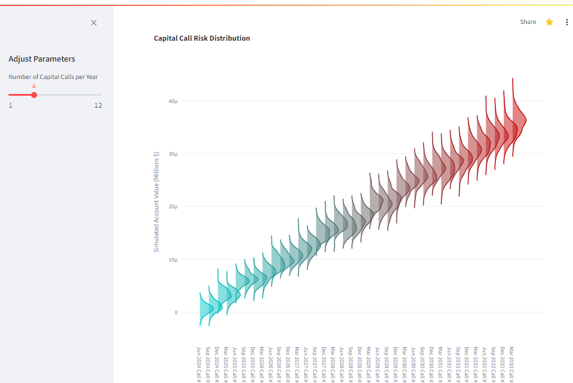

# Capital Call Analysis Dashboard

This Streamlit-based dashboard provides a comprehensive analysis of capital calls, forecasts, and cash flow simulations in private equity investments.

Link to app: https://capital-call-analysis-dashboard.streamlit.app/

## Features

* **Capital Call Risk Distribution:** Visualizes the risk distribution of capital calls over time.
* **Invested Capital Relative to Commitment Level:** Tracks the percentage of invested capital compared to the committed capital.
* **Cumulative Net Cash Flow:** Displays the cumulative net cash flow over time.
* **Forecasted Account Values with Confidence Interval:** Uses Monte Carlo simulation to forecast potential future account values.
* **Context and Analysis:** Provides detailed analysis of the dashboard's findings and potential areas for improvement.

## Installation

1. Clone this repository: `git clone https://github.com/<your-username>/capital-call-analysis-dashboard.git`
2. Install the required libraries: `pip install -r requirements.txt`
3. Run the dashboard: `streamlit run app.py`

## Usage

Interact with the dashboard by adjusting parameters in the sidebar:

* **Number of Capital Calls per Year:**  Control the frequency of capital calls.

Explore the different visualizations and analyze the results.

## Contributing

Contributions are welcome! Feel free to open an issue or submit a pull request.

## License

This project is licensed under the MIT License - see the LICENSE file for details.
